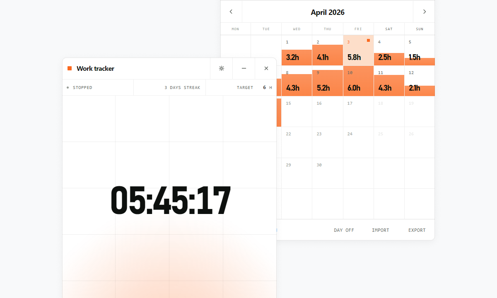

# Minimal Worktime Tracker

Minimal Worktime Tracker is a desktop app for tracking work time on Electron.

It is built to keep progress visible rather than hidden. When hours, the calendar, and the current work streak sit in one place, it is easier to keep a steady pace day after day. The value is in accumulation: once progress is visible, it is easier to continue tomorrow than to start from zero again.



## What it does

- work time timer
- calendar with per-day progress
- consecutive workday streak
- day-off marking
- Windows autostart
- tray integration
- automatic backups
- language, week start, and date format settings

## Run

```bash
npm install
npm start
```

After launch, close the window with `X` and the app will stay in the tray.

## Build

```bash
npm run dist
```

Windows build artifacts will appear in `release/`:

- `*.exe` installer for installation
- `*.exe` portable build for running without installation
